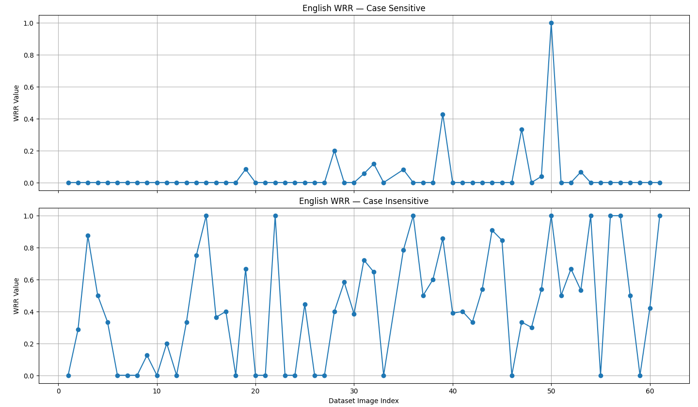

# Deliverables

- Ground-truth annotations (`ground_truth.json`) with polygon coordinates, visible transcriptions, and per-region `script_language` labels.
- Example model predictions (`model_output.json`) produced via the included inference example.
- Evaluation script and artifacts (`model_eval.py`, plots and per-image metrics) used to measure recognition performance.

# File structure

- `Raw_Images/` — collected scene photographs used for annotation and testing.
- `ground_truth.json` — canonical polygon-level annotations and transcriptions (UTF-8).
- `model_output.json` — exported OCR predictions (same schema as ground truth).
- `infer.ipynb` — example notebook used to run the IndicPhotoOCR pipeline and export predictions.
- `model_eval.py` — evaluation script computing WRR and Precision/Recall/F1 and producing visual summaries.
- `Model_Output/`, `results/` — folders intended to hold inference outputs, visualizations and saved metrics.

# Evaluation (how the model was assessed)

The evaluation focused on word-level and token-level matching between `ground_truth.json` and `model_output.json`.

- **Word Recognition Rate (WRR)**: computed as the fraction of ground-truth word occurrences that are matched by the model's predicted words. Matching uses multiset (counter) semantics so repeated words are handled correctly.

- **Precision / Recall / F1**: calculated on token lists derived from each script group. 

- **Case-sensitive vs case-insensitive**: both variants are reported.
	- **Case-sensitive**: exact string matches only.
	- **Case-insensitive**: both ground truth and predictions are normalized to lowercase before matching, capturing recognition that differs only by letter case.

- **Script handling**: Devanagari variants were aggregated by mapping `marathi` into `hindi` in the evaluation step to align with how the OCR pipeline reports Devanagari results.

# WRR plots

- WRR plot — Hindi (case-sensitive / case-insensitive):

    

- WRR plot — English (case-sensitive / case-insensitive):

	

# References and Sources

This project was built upon the following resources and tools:

- **IndicPhotoOCR**: The core OCR pipeline used for inference and evaluation. See [Bhashini-IITJ/IndicPhotoOCR](https://github.com/Bhashini-IITJ/IndicPhotoOCR) for the original repository and documentation.

- **VIA (VGG Image Annotator)**: Used for polygon-level annotation and transcription of the dataset. More information available at [VIA Project](http://www.robots.ox.ac.uk/~vgg/software/via/).

# Acknowledgements

We acknowledge the IndicPhotoOCR team at Bhashini-IITJ for the OCR pipeline and the VGG Image Annotator project for the annotation tooling that made this evaluation dataset possible.